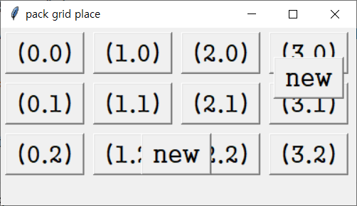

# GUI_python
간단하게 GUI 프로그램 만드는것 / 프로그램 개발을 쉽게 

## 1번째 방법
### python 에 기본적으로 들어 있는 tkinter를 이용하는 방법

이것은 아주 단순한 기능만을 제공 하고 있다 

### pack option
 시작위치 widget.pack(side = left,right,[top],bottom)
 
 간격주기 상하 widget.pack(side = top, pady = 20)
 
 간격주기 좌우 widget.pack(side = left, padx = 30)

### grid option
 위치지정 widget.grid(column = 0, row = 2) 빈공간 금지  0,4 시에 0,3이 비었으면 강제로 올라감
 
 셀병합 widget.grid(column =2 , row =0,rowspan = 2) 2,0의 아래로 2만큼을 합친다. column = 0, row 3, columnspan =2
 

### place option
 위치지정 widget.place(x = 30, y =40) widget.place(relx =0.3, rely = 0.4)
 
 ***
 ### 간단한 코드 설명
```
from tkinter import *
win = Tk()
win.geometry('400x200')
win.title('pack grid place')
win.option_add('*Font','궁서 20')

 4 x 3 버튼 만들기
colNum = 4
rowNum = 3
btnList = []
for j in range(0,rowNum):
    for i in range(0,colNum):
        btn = Button(win)
        btn.config(text = '({}.{})'.format(i,j) )
        btn.grid(column = i, row = j, padx = 5, pady = 5)
        btnList.append(btn)

btn = Button(win)
btn.config(text = 'new')
btn.grid(column=3, row=0, rowspan=2)

btn = Button(win)
btn.config(text = 'new')
btn.grid(column=1, row=2, columnspan=2)

win.mainloop()
```
## 실행 결과
</img><br/>

## 그리고 몇가지 소스를 첨부 해 놓겠음.
